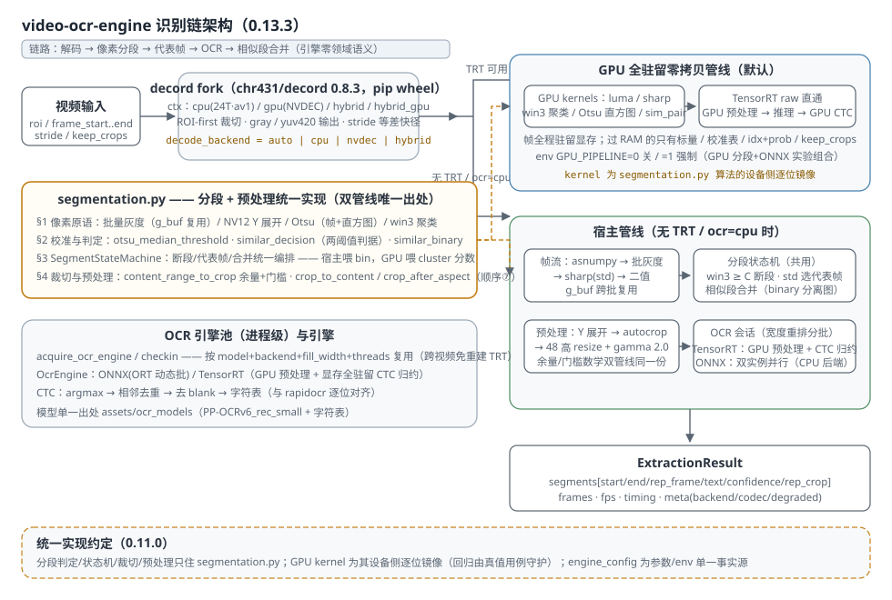

# video-ocr-engine

从视频**固定区域**提取文本的通用引擎：`解码 → 像素分段 → 代表帧 → OCR 文本（含置信度）`。

- **输出只有文本与置信度**——不解析领域含义。速度数字识别、字幕提取、固定字幕条
  OCR 等通用场景直接可用；上层应用自行做数值解析/纠错。
- **零领域语义**：构造参数仅引擎域（`video_path / roi / frame_start / frame_end /
  decode_backend / ocr_backend / buffer_size / fill_width ...`），不含速度/纠错参数。
- **解码器只输出 ROI**（自建 [chr431/decord](https://github.com/chr431/decord) fork 的
  ROI-first 管线），非识别区域不参与转换，显著提速。
- 自 [RaceVideoToLog](https://github.com/chr431/RaceVideoToLog) v2.15.2 拆分独立。



## 安装

### 直接使用源码（推荐；生产项目以 pip 依赖 + git tag 锁定，submodule 已于 2026-08-30 废弃）

引擎仓库根目录即 Python 源码根目录，把本目录加入 `PYTHONPATH` / `sys.path` 即可：

```python
import sys
sys.path.insert(0, r"path\to\video_ocr_engine")   # 仓库根目录
from video_ocr_engine import FieldExtractor
```

### pip 安装

```bash
pip install -e .            # 或 pip install .（自带 OCR 模型，~21MB）
```

Python 3.11+。运行时依赖 `numpy / onnxruntime / psutil`。

### 解码后端（decord fork，必需）

解码使用自建 fork（`chr431/decord`，支持 NVDEC GPU 硬解码、ROI-only 输出、
`yuv420` 输出）。PyPI 版 decord 不支持。**0.8.2 起直接 pip 安装 release wheel**
（自带 `decord.dll` 与 FFmpeg 63 运行库，完全自包含；提供 cp39–cp314）：

```bash
# 从 chr431/decord 的 release 下载对应 Python 版本的 wheel 后：
pip install decord-0.8.2-cp313-cp313-win_amd64.whl
```

> 0.8.1 起硬性要求 FFmpeg 9（FFmpeg 7/8 支持已删除）；wheel 已打包运行库，
> 无外部 FFmpeg 依赖。GPU OCR（TensorRT）还需 CUDA/TensorRT DLL 在 PATH；
> 缺失时 OCR 自动回退 CPU（onnxruntime）。

> GPU OCR（TensorRT）还需 CUDA Toolkit + TensorRT 并加入 PATH；缺失时自动回退
> CPU（onnxruntime）。

## 用法

```python
from video_ocr_engine import FieldExtractor

ex = FieldExtractor(
    video_path="subtitle_episode.mkv",
    roi=(10, 850, 1910, 940),        # 字幕条区域 (x1, y1, x2, y2)
    frame_start=0,                    # 可选；0 或 None = 到片尾（负数报错）
    frame_end=None,                   # 可选；0 或 None = 到片尾（超界按片尾
                                      # 截断并 warning）
    decode_backend="auto",            # auto/cpu/nvdec/hybrid
    ocr_backend="cpu",                # auto/cpu/tensorrt
    rep_crop_format="yuv",            # 代表帧格式："yuv"=packed NV12（默认；
                                      # 内部链恒为单通道灰度，外部用
                                      # video_utils.nv12_to_rgb 转 RGB）或 "gray"
    keep_crops=True,                  # 是否在结果中保留每段代表帧图像
    keep_frames=True,                 # 是否在结果中保留每段帧号序列
    merge_similar=True,               # 是否合并视觉相似相邻段（默认开启）
    merge_similar_threshold=3.0,      # 相似判定阈值（灰度平均绝对差）
    merge_text_sep="binary",          # 相似帧合并用的分离方案（默认 binary）
)
result = ex.extract()

print(result.fps)
for seg in result.segments:
    if seg.text:
        print(f"frames {seg.start}-{seg.end}  text={seg.text!r}  conf={seg.confidence:.4f}")
```

> `FieldExtractor` 是**单次提取**对象：`extract()` 每次全量重跑（重新打开
> 解码器/校准/取 OCR 引擎）并覆盖实例状态。结果请以返回值为准；
> `ex.frames / ex.crops / ex.timing` 等实例属性是兼容性副产物，勿与返回值混用。
> 批量多视频请各建实例（见下文"批量处理"）。

> 参数选择提示：`fill_width`（OCR 输入 pad 宽下限）的最优值依赖 `force_aspect`
> ——`force_aspect>0`（内容被压窄）时越大越准，`=0` 时偏小更佳，两者应一起调
> （2026-08-29 曾因单调 fill_width 踩坑回退默认值，见 `engine_config.py` 注释（实现已迁 `video_ocr_engine/config/constants.py`，根处为兼容 shim））。

`decode_backend="auto"` 的默认逻辑：**恒为 NVDEC 优先，不可用时回退 CPU**
（刻意决策，2026-09-10 重申：弱 CPU 上 h264 软解可能慢于 NVDEC，且 CPU
解码必然引入资源争用与整机功耗上升，NVDEC 稳妥优先，不按编码分流）。

**按编码选后端**（本机 7945HX + RTX 4060，3000 帧实测热轮中位；换机需按
`docs/CONCLUSIONS.md` C-04/C-05/C-08 的复评条件重测）：

| 片源编码 | 最快 | 次优 | `auto`（NVDEC） | 相对最优 |
|---|---|---|---|---|
| **h264** | `decode_backend="cpu"` 0.99 s | `"hybrid"` 1.38 s | 3.11 s | **慢 3.1×** |
| **hevc** | `auto`/`"nvdec"` 1.53 s | `"hybrid"` 1.58 s | 1.53 s | 已最优 |
| **av1** | `"hybrid"` 1.37 s | `"nvdec"` 1.82 s | 1.82 s | **慢 33%** |

即：h264 且 CPU 核多时**显式**选 `cpu`；av1 选 `hybrid`；hevc 保持默认。
（`auto` 不自动分流，是上面那条刻意决策。）

`decode_backend="hybrid"` 由 **decord fork 原生实现**（≥v0.7.15）：同一实例内
NVDEC 与 CPU 软解并行解码，分片与负载调度在 decord 内部完成，引擎只透传解码
参数（参数面与 `cpu` / `nvdec` 完全一致，含 `sample_stride`）。要求 NVDEC 可用；
OCR 在 GPU（TRT）时走 `hybrid_gpu` 上下文，输出帧驻留显存、直通零拷贝管线；
OCR 在 CPU 时输出宿主帧。打开失败自动降级（`meta.degraded_reason` 有记录）。
CPU 分片线程档位默认 **核数//2 钳 [8,16]**（实测 12→16：h264 −6.5%、hevc −12.7%）；
差距分解（解码器调度侧 23–33% 与引擎 CPU 争用 10–27%）见
`docs/log/2026-09-11-hybrid差距分解.md`。

> **迁移记录**：原项目层实现（hybrid_decode.py，已于 2026-09-06 删除）由 decord
> 原生实现取代（commit `fd3bcda`）；决策/历史见 `docs/log/DECISIONS.md` 与
> `docs/log/PERFORMANCE.md` §24，结论状态见 `docs/CONCLUSIONS.md` C-05/C-06。

`result` 为 `ExtractionResult`：

| 字段 | 含义 |
|------|------|
| `segments` | `list[ExtractedSegment]`：`start/end/frames/rep_frame/text/confidence/rep_crop` |
| `frames` | 全部采样帧号 |
| `fps` | 自测帧率（从解码器读取，忽略外部传入） |
| `timing` | 各阶段耗时（`decode` / `ocr` / `ocr_tail`） |
| `meta` | `backend / ocr_backend / codec / n_segments / engine_version / params（本次生效参数）/ degraded_reason（降级原因）/ color_range / rep_crop_format` |

> 进度回调口径：引擎初始化 ~2.5%、解码/分段 3→58、OCR 58→86——**上限 86%**
> （OCR 收尾与结果组装无进度事件）。

> 引擎内部链恒为单通道灰度（解码输出 `yuv420` 或 `gray`，不再输出 RGB 帧——
> RGB→灰度转换由解码侧/fork 完成）。`rep_crop` 的像素格式由
> `rep_crop_format` 决定：默认 `"yuv"` = packed NV12（`video_utils.nv12_to_rgb`
> 转 RGB 预览，BT.601 limited 矩阵，仅代表帧调用、毫秒级）；`"gray"` = 灰度。
> 预览可直接用 `result.rep_crop_rgb(seg)`（按 `meta` 自动选格式/色域）。
> `keep_crops=False` 时自动退化为 `gray` 解码输出（省 UV 传输）。
> （0.7.0 的 deprecated 别名 `gray_output` / `yuv_output` 已于 0.9.0 删除，
> 一律使用 `rep_crop_format`。）

## 分频采样（sample_stride 参数）

`FieldExtractor(sample_stride=N)`（默认 1）：`>1` 时只解码/分段/OCR 每个第 N 帧——
字幕等 ROI 更新较慢时显著降低处理压力，时间戳仍取真实帧号（准确度基本不变）。
需 decord fork ≥v0.7.12 的 `GetBatch` 等差步长快速路径（顺序流式跳帧）；旧版退化
为逐索引 seek（仍正确但 AV1/HEVC 上更慢）。`stride=1`（默认）与 RaceVideoToLog
完全兼容（零改动）。

> 长视频/大 ROI 场景若不需要预览图，可设 `keep_crops=False`、`keep_frames=False`
> 显著降低内存占用（默认 `True` 保持兼容）。注意 `keep_frames=False` 同时清空
> **段级** `frames` 序列（仅保留 `start/end/rep_frame`），依赖"段→帧区间"的
> 下游会拿到空序列。

> 面向字幕提取的完整 CLI 应用已拆到独立仓库
> [chr431/video_subtitle_extractor](https://github.com/chr431/video_subtitle_extractor)：
> 提供 `--roi`/`--start-frame`/`--end-frame`/`--sample-stride` 等参数，输出
> `time_sec,text` 两列 CSV。本引擎仓库保持为通用引擎（不携带具体场景 CLI）。

## 批量处理：多实例并发（多集/多视频）

多个视频的批量处理建议用**多线程并发多个独立 `FieldExtractor` 实例**，
按后端互补配对（实测 7945HX 16C32T + RTX 4060，两视频各 30000 帧 stride8，
seg/text 与顺序完全一致）：

| 配对 | 聚合加速 | 说明 |
|---|---:|---|
| **1×NVDEC+TRT ∥ 1×CPU+ONNX** | **~1.8×** | 解码器 + 加速器双重互补，对端完全不占 GPU，**首选** |
| **1×NVDEC+TRT ∥ 1×CPU+TRT** | **~1.5–1.85×** | 仅解码器互补；对端软解快（h264）时会抢 GPU，掉到 1.5× |
| 2×CPU+TRT | ~1.4× | 靠核富余；少核机收益递减 |
| 2×NVDEC+TRT | **~1.0–1.2×** | 单 NVDEC 硬件单元，双会话互相争抢，基本等于串行 |

> **实测修订**（证据与消元过程见 `docs/log/PERFORMANCE.md` §19/§21）：「IO 竞争」
> 与「内存带宽」均已证伪——并发退化真因是**单一 NVDEC 硬件单元串行化**；
> 加速比按聚合吞吐口径看（互补配对 1.83–1.87×，双 NVDEC 仅 1.01–1.20×）。
> 支配变量是对端往 GPU 提交工作的速率；编码决定一切（h264 上 CPU 软解比
> NVDEC 快 2.6×，AV1 上慢 2.9×），选配对前先看对端视频的编码。

```python
import threading
threads = [threading.Thread(target=extract, args=(video, backend)) for ...]
```

**显式预热**（可选）：冷启动的 OCR 引擎构建（TRT 反序列化 ~0.4s）可以提前：

```python
ex = FieldExtractor(...)
ex.warmup()          # 把一次性成本挪到此刻（0.4–0.5s）
ex.extract()         # 首个 extract 的 ocr.engine_init → ~0.0001s，首视频 −33%
```

预热**不改变总吞吐**（只是把成本提前），也不会自动触发；它服务"要连跑
多个视频 / 需要稳定首帧延迟"的场景。批量循环前对**任意一个**实例调一次
即可（引擎池按"模型/引擎类型/pad 下限/线程数"共享）。

**运行报告**：`extract()` 返回的 `result.meta["report"]` 里带一份 RunReport
（schema 版本化，当前 **v2**）：相位 span、全部计数器、PI 健康判定（热池
`engine_init` <0.1s、`syncs/chunk` ≤3）、环境指纹（commit 之外的
GPU/driver/TRT/decord 版本），以及 v2 新增的**资源段**：

| 段 | 档位 | 内容 |
|---|---|---|
| `resources.per_phase` | std+ | 每个粗相位边界的**差分**：墙钟、**平均并行核数**、活跃线程数、RSS 增量、磁盘读写 MB/s、显存占用 |
| `resources.sources` | std+ | 每个读数的**真实来源**或 `unavailable:原因`（不用 None/0 冒充真值） |
| `hardware` | full | NVML 低优先级采样（~200ms、上限 600 点、关停丢半帧）：GPU% / **NVDEC%** / 显存的 min/p50/p99/max + 采样失败计数 |

资源层只用 stdlib（`time.process_time` + kernel32/psapi ctypes）——实测
`psutil.Process.threads()` 在本机要 **43ms 一次**，用在遥测路径上会直接吃满
PI-15 预算，故有测试禁止产品代码调用它。**本机自测口径、跨机不可比**；PCIe
本机不可直读，报告不产该字段（只能由 counter 字节 ÷ 相位墙钟推算）。
读数工具：`python tools/_probe_phase_cores.py --configs h264-cpu,h264-hybrid`。

默认档 `std` 开销在噪声内（PI-15 复测见 `docs/log/`）；`VOE_TELEMETRY=off`
一行关掉（`meta` 无 `report` 键、不组装报告、不建探针）；
`VOE_REPORT_FILE=<path>` 可把细档 JSON 落盘。A/B 用
`python tools/bench.py run/diff/ab`（报告口径，不写探针）。

要点：实例完全独立（各自 OCR 会话/TRT 上下文共存正常）；GIL 无碍
（GPU 管线消费线程极轻）。`decode_backend="cpu"` 与 `"auto"` 混搭即可
构成互补对 —— 但**必须显式**给要走 CPU 的那条传 `"cpu"`：`"auto"` 恒为
NVDEC 优先（刻意决策，见 `docs/CONCLUSIONS.md` C-07/C-08），指望 auto
自动配成 CPU 解码是无效的。跑完后用 `FieldExtractor._backend` 核验实际
后端。少核（≤8 核）机器收益递减，建议先小规模试测。详见
`docs/log/ARCHIVE.md` §16.8.2 的实测表。

## 识别链

1. 校准：前 `SEG_CALIB_FRAMES` 帧 Otsu 求二值化阈值（仅在变化显著时切段）。
2. 分段：ROI 灰度逐帧异或 + 3×3 聚类判别（`_cluster_win3`，纯 numpy）。
3. 代表帧：段内灰度 std 最大者为最清晰帧。
4. OCR：代表帧 → 48 高 resize + 灰度 gamma 2.0 → PP-OCRv6_small（ONNX/TensorRT）。

解码∥分段∥OCR 三级流水线 + 有界队列背压（`OCR_BATCH_SIZE` / `buffer_size`），
解码与 OCR 线程重叠摊薄墙钟。

**分段与预处理的实现单一出处**：校准/断段/相似合并的判定、分段状态机、
内容自适应裁切与 resize+gamma 预处理统一实现于 `segmentation.py`，宿主管线
直接调用；GPU 全驻留管线的 CUDA kernel（`_gpu_kernels.py`）是其设备侧
**逐位镜像**（像素操作无法跨 numpy/CUDA 共享），判定阈值/裁切余量/合并
判据统一引用同一文件，两侧语义只有一个出处。

### 显存全驻留零拷贝管线（NVDEC+TRT 时默认启用）

NVDEC+TensorRT 可用（`decode_backend∈{auto,nvdec,cpu,hybrid}`、`ocr_backend≠cpu`；
`cpu` 分支不依赖 NVDEC）时，
识别链默认切换为**显存全驻留零拷贝**路径：NVDEC 解码、灰度（`yuv420` 时由
`luma_nv12` kernel 在 GPU 提取 Y 平面，与宿主逐位一致）、sharp/聚类分段、
Otsu 校准、merge_similar 判定（GPU `sim_pair`；contrast 模式在边界时 D2H 两
帧走宿主判定）、代表帧保活（gray 直通 decord 指针 / yuv 用 `_YFramePool`
池帧按需提取 Y）、TensorRT 推理（single TRT 引擎，`force_aspect` 已支持）
与 CTC 预归约全部在 GPU 内闭环——过 RAM 的只有每帧两个标量、校准直方图表、
合并判定标量（contrast 时两帧）、CTC 归约结果与 `keep_crops` 输出（每段一
张，结果给外部）。分段/合并判定/输出与宿主路径一致。

- 干净环境小幅更快（窗口实测约 -10%），对端大内存流量时显著更稳
  （对端 ~100GB/s 流拷贝下退化 ×1.36 vs 宿主 ×1.70）
- 整集 stride=8 场景两路径同受 NVDEC 跳帧解码供给率限制，速度持平
- 默认只放行"全程 raw"（NVDEC+TRT）；GPU 分段 + ONNX OCR 实测无净收益
  （见 `docs/log/PERFORMANCE.md` §9）→ 无 TRT / `ocr_backend="cpu"` 走宿主
- env `GPU_PIPELINE=0` 显式关闭；`=1` 强制启用（含 GPU 分段+ONNX 实验组合）；
  `decode_backend="hybrid"` + TRT 走 decord 原生 `hybrid_gpu`，帧全程驻留
  显存、直接进零拷贝管线的设备指针通路

**CPU 解码也走 GPU 管线（P1-3 解耦）**：`decode_backend="cpu"`（或 auto 的
NVDEC 回退）+ TRT 可用时，每批帧经宿主灰度转换后 H2D 进同一套 GPU
分段/校准 kernel，代表帧留显存供 raw OCR——CPU 软解的高吞吐（h264 上约
2× NVDEC）与零拷贝 OCR 不再互斥。实测（7945HX + RTX 4060）：test5 全片
墙钟 -7.8%~-11%，真值准确率与宿主路径 +0.00pp（逐位一致）。

## 环境变量钩子

> 构造参数已覆盖绝大多数用法；环境变量仅在**批量调优/诊断**时使用。
> 未设置 = 引擎默认值（已按实测调优，见 `docs/log/PERFORMANCE.md`"已锁定参数"）。

**优先级**：同一旋钮多入口时按 **env > 构造参数 > `engine_config` 常量** 生效
（例：构造 `fill_width=320` 会被残留的 `OCR_PAD_SMALL` 静默盖过——排查调参时
先确认 env 是否残留）。**仅 env 入口**（无构造参数承接）的旋钮：
`OCR_GAMMA`、`OCR_ROI_AUTOCROP / _MARGIN / _MIN_GAIN`、`OCR_REORDER_WINDOW`、
`OCR_INSTANCES`、`GPU_PIPELINE`、`DECODE_THREADS`、`HYBRID_CPU_THREADS`。

**生效时机**：下列 env 全部为**调用期读取**——构造 `FieldExtractor(...)` 之后
再改 env 同样生效，无需重建实例（`DECORD_SKIP_LOOP_FILTER` 例外，由 decord
在打开解码器时读取）。

### 用户调参（了解影响后再动）

| 变量 | 作用 |
|------|------|
| `GPU_PIPELINE` | 零拷贝管线：未设置 = NVDEC+TRT 时默认启用；`0` 显式关闭；`1` 强制启用（含 GPU 分段+ONNX 等实验组合） |
| `GPU_PIPELINE_STREAM` | `1` 开启 decord `get_batch_stream` chunk 粒度流水发射（解码与消费重叠；默认关——实测零收益，见 C-10） |
| `OCR_THREADS` | OCR 推理线程数覆盖（默认全物理核） |
| `OCR_BATCH` | OCR 批大小覆盖（默认 16） |
| `OCR_PAD_SMALL` | OCR 输入 pad 宽度下限覆盖（未设置时由构造参数 `fill_width` 决定，默认 224；此 env 优先级**高于**构造参数，调这个就能改 pad 下限） |
| `OCR_GAMMA` | OCR 预处理 gamma（默认 2.0） |
| `OCR_ROI_AUTOCROP` | `0` 关闭 OCR 输入宽度自适应裁切（默认开；按二值图内容列裁掉两侧空白，生产门禁 5 视频原始误读 **148 → 124**；真值口径四片均值 +0.82pp，**该 pp 值测于 pad 160 时代，pad 已回退 224，勿直接引用**） |
| `OCR_ROI_AUTOCROP_MARGIN` | 裁切时内容两侧保留的余量（占 ROI 宽 %，默认 10；**调小会插入多余空格且准确率下降**，见 `docs/log/ARCHIVE.md` §16.2 P0-4） |
| `OCR_REORDER_WINDOW` | OCR 重排窗口段数（默认 64；按宽度分组才能让 pad 宽真的降下来） |
| `DECORD_SKIP_LOOP_FILTER` | **显式 opt-in**（2026-08-30 起，默认**不设置**——import 不再改写进程级 env）：设为 `all` 开启 CPU 软解关去块滤波，须在打开解码器前设置。收益：HEVC **-8.3%~-14.3% 墙钟**、h264 -0.6%~-4.2%、AV1 无效（-0.2%）；NVDEC 不受影响。六片真值 + test4 逐帧**视觉裁定**确认对 OCR 无负面影响（5 片 +0.00~+0.08pp；test4 账面 −0.19pp 系真值伪影——显示为三位补零 `020`、真值剥零，视觉裁定按显示忠实度关滤波反而略优）。注意：显示为 2 位数字时输出会带前导零（`020`，更忠实于显示），下游字符串匹配需注意；rep_crop 预览有块状伪影。需 decord fork ≥v0.7.13 |
| `DECODE_THREADS` | CPU 软解 FFmpeg 帧线程数覆盖（默认按 OCR 落点 + 采样步长分档：OCR 在 GPU 取满逻辑核钳 8~32；OCR 在 CPU 时 stride>1 取逻辑核 3/4 钳 8~24、stride==1 取 1/3 钳 8~12） |
| `TEXT_SEP_MERGE` | 相似段合并分离模式（binary/off；contrast 已于 0.9.0 删除） |
| `HYBRID_CPU_THREADS` | 混合解码（decord 原生）中 CPU 软解线程数（默认 0 = **自动：与 CPU 软解后端同一 codec 感知策略**，即 `DECODE_THREADS` 的分档公式；2026-09-12 §14 引擎全片 e2e 定档）。项目层时代的线程数 A/B 实测（方向性结论仍可参考）见 `docs/log/PERFORMANCE.md` §17.2 |

### 实验/诊断（排查问题时用）

| 变量 | 作用 |
|------|------|
| `GPU_CTC` | `0` 关闭 TRT 输出的 GPU argmax 归约（默认开；仅影响 GPU 管线） |
| `OCR_INSTANCES` | `0` 关闭并行双 ONNX 实例（CPU 核数≥8 默认开） |
| `ENGINE_PROFILE` | `1` 开启引擎细粒度性能剖面 |
| `TRT_SUBPROBE` | `1` 开启 TRT 子相位探针 |
| `DEBUG_BOUNDS` | `1` 打印分段边界调试信息 |

> 已删除钩子（0.9.0 清理轮；2026-09-06 hybrid 迁移轮删除的项目层
> `HYBRID_*` 参数，仅 `HYBRID_CPU_THREADS` 保留见上表）的完整清单与历史
> 结论见 `docs/log/DECISIONS.md`，结论状态见 `docs/CONCLUSIONS.md`。

内部实现（`engine_config` 常量、`_gpu_pipeline` 门控等）不在本表；如需深入，
以 `engine_config.py` 为唯一事实源（实现已迁 `video_ocr_engine/config/constants.py`，根处为兼容 shim）。

## 文档

- [现役结论索引](docs/CONCLUSIONS.md) —— **动手前先查**：每条结论带状态
  （active / superseded / dead）、前提条件与复评触发；新结论一行写这里。
- [性能调优记录](docs/log/PERFORMANCE.md) —— 性能实验史与实测细节（**已冻结增长**，
  新叙事进 `docs/log/`）；需要证据链/原始数据时按节读，勿整读。
- [历史归档](docs/log/ARCHIVE.md) —— §4 / §8 / §16 / §18（**编号保留**）：2026-08-29 路线图
  快照（开头有校正表）、已删除功能档案。**纯历史，勿当现役依据**。
- [开发决策档案](docs/log/DECISIONS.md) —— 每轮决策过程与设计审查结论（维护者向）。
- [依赖与运行环境](docs/DEPENDENCIES.md) —— decord fork / TensorRT / onnxruntime 版本与注意事项。
- `AGENTS.md` —— 维护者向**注入核**：铁律 + 现役架构 + 结论指针。
  ⚠️ 该文件在每个会话开头被全量注入，**硬上限 12 KB**（由单测守护）。

> 文档共七份（另有 `docs/log/` 实验叙事目录）。2026-09-08 起按
> 「事实 / 结论 / 决策 / 历史」四层管理，见 `docs/log/DECISIONS.md`「文档分层管理」。
> `docs/log/PERFORMANCE.md` 中凡提及 §4 / §8 / §16 / §18 的，均指 `docs/log/ARCHIVE.md`
> 的对应章节。工具脚本索引见 [`tools/INDEX.md`](tools/INDEX.md)。

## 测试

```bash
pip install -e ".[dev]"
python -m pytest tests/ -v
```

纯单元测试无需视频 / decord / GPU（OCR 用例用 onnxruntime CPU + 仓库内模型）。
解码路径的集成验证不在单元测试内——真实视频/decord 的端到端验收由下面的
`tools/e2e_smoke.py` 承担。

### 端到端冒烟 / 性能工具（真实视频）

`tools/e2e_smoke.py`：同一视频窗口跑配置矩阵（GPU 零拷贝 / GPU 灰度 raw /
keep 关闭 / 宿主+TRT / CPU+ONNX / hybrid / GPU 分段+ONNX），校验跨路径文本
一致性、代表帧格式、段序/置信度，可对照 Race ground-truth CSV 验证匹配率，
并可重复跑测墙钟与分相耗时。示例：

```bash
# 功能矩阵 + 真值验证（ROI/帧区间可自动从 truth CSV 头读）
python tools/e2e_smoke.py --video D:\Videos\racelog_test\test5.mp4 \
    --roi 843,993,948,1025 \
    --truth D:\Videos\racelog_test\ground_truth_csv\test5_ref.csv \
    --frames 5000 --stride 8 --verify

# 只探视频/后端元数据；性能测试（重复跑 + ENGINE_PROFILE）
python tools/e2e_smoke.py --video X --roi A --probe
python tools/e2e_smoke.py --video X --roi A --perf --runs 3 --frames 3000
```

运行 GPU 路径需：decord fork（ROI-first / GPU gray / yuv420）、`cuda-python`
（分段/校准/CTC kernel）、TensorRT thin binding（`tensorrt-cu13-bindings`
+ `tensorrt-cu13` 元包 shim，DLL 从系统 PATH 加载）。

## 许可证

**Apache-2.0**。本引擎是独立通用库：不依赖 Qt/GUI 组件，无 copyleft 传染，
可自由用于开源与商业项目（其依赖 decord / PP-OCRv6 亦为宽松或兼容许可）。

> 来源说明：引擎由 RaceVideoToLog（GPL-3.0）拆分而来，代码为原作者原创作品，
> 拆分时已重新授权为 Apache-2.0。RaceVideoToLog 本身因依赖
> PySide6-Fluent-Widgets（GPLv3）仍保持 GPL-3.0，但可自由包含本引擎（现为 pip 依赖 + git tag 锁定）。
